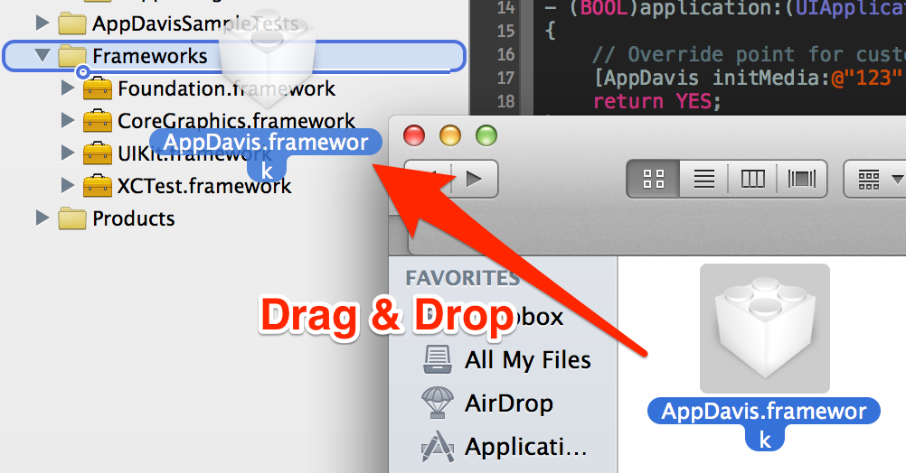
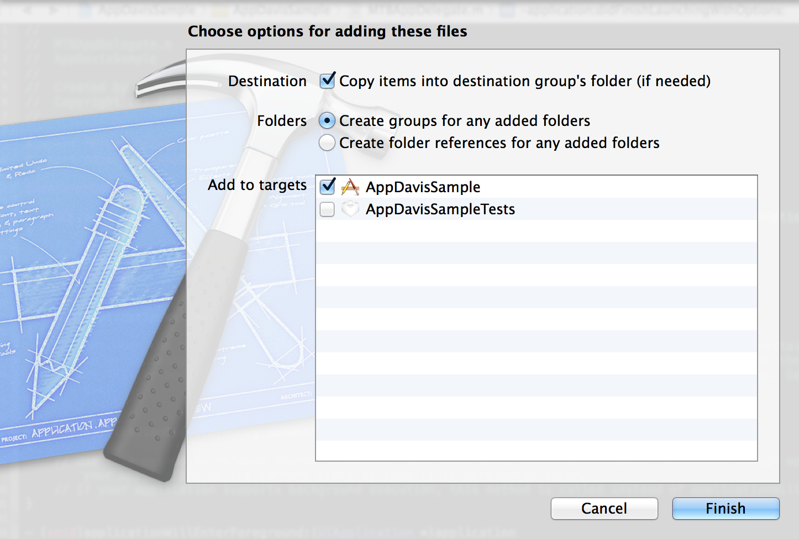
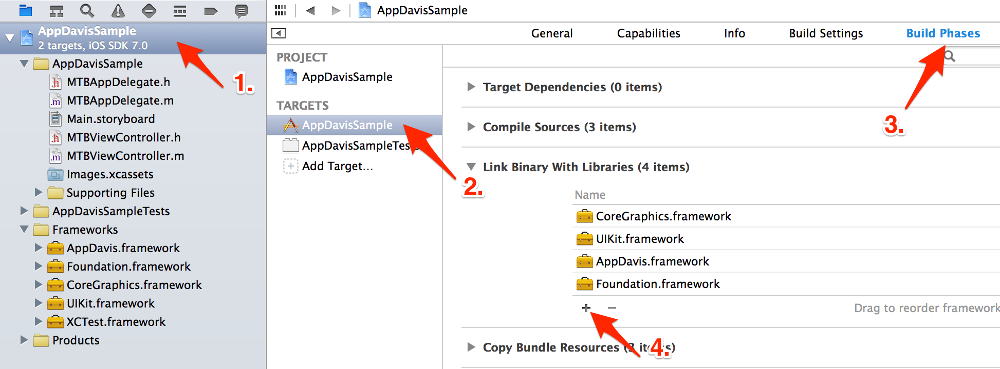
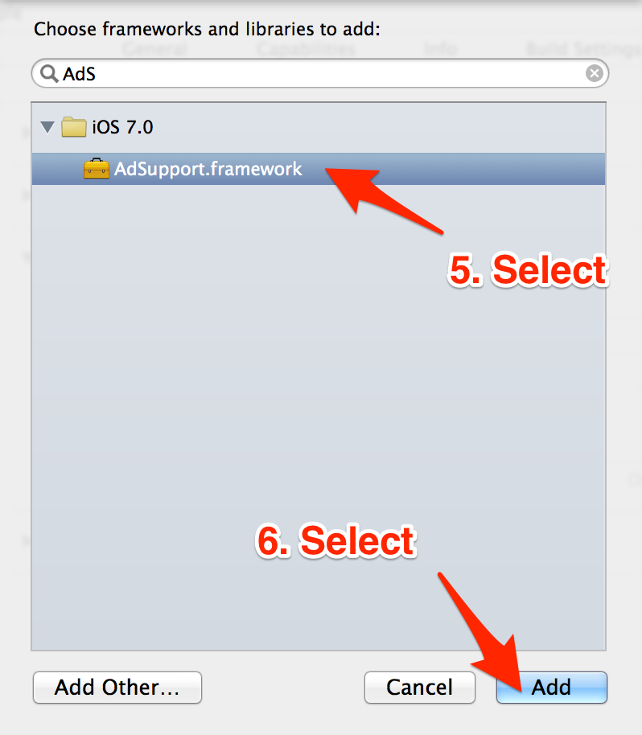
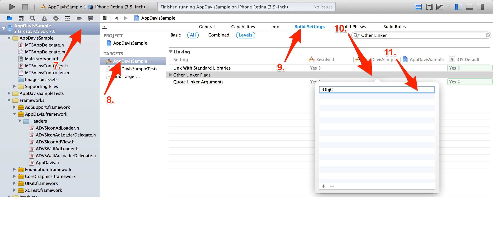

# 目次

* [対応環境](#対応環境)
* [開発環境](#開発環境)
* [IDFAの使用について](#IDFAの使用について)
* [AppDavis iOS SDK をダウンロード](#AppDavis iOS SDK をダウンロード)
* [AppDavis iOS SDK をインストール](#AppDavis iOS SDK をインストール)
* [CocoaPods の利用](#CocoaPodsの利用)

本ドキュメントは AppDavis iOS SDK を Xcode のプロジェクトに追加し、実際に使える所までを記したものです。

# 対応環境

動作する **iOS のバージョンは 6.0 以上**になります。

動作確認を行っているデバイスは以下になります。

| デバイス種類 |                    モデル名                     |
|--------------|-------------------------------------------------|
|    iPhone    |             iPhone 5                            |
|     iPad     |              iPad Air                           |
|  iPod Touch  |        iPod Touch 第四世代                      |

上記以外のデバイスでは動作しない可能性があります。

お困りの際は以下のサポートまで一報ください。

[a@mtburn.com](a@mtburn.com)

# 開発環境

サポートする **Xcode のバージョンは 5.0 以上**としています。

# IDFAの使用について

本SDKは広告の成果測定のため IDFA を利用しています。

# AppDavis iOS SDK をダウンロード

以下の URL から AppDavis iOS SDK をダウンロードします。

[AppDavis iOS SDK をダウンロード](https://banner.dspcdn.com/mtbimg/resource/AppDavis.1.0.5.zip)

ダウンロードが完了したら、取得した zip ファイルを解凍して以下の Framework ファイルを確認して下さい。

```
AppDavis.framework
```

# AppDavis iOS SDK をインストール

上記で取得した Framework ファイルをプロジェクトへ追加します。

AppDavis.framework をドラッグ&ドロップで、プロジェクトの Frameworks ディレクトリに入れて下さい。





追加時に出てくるオプション情報入力では以下の様にして下さい。





Frameworks グループに AppDavis.framework が追加された事を確認できたら、以下の順番で追加する AdSupport.Framework を設定します。

- 1.プロジェクトファイルを選択

- 2.ビルドターゲットを選択

- 3.Build Phase タブを選択

- 4.Link Binary with Libraries セクションの + ボタンをクリック





- 5.AdSupport.framework を選択

- 6.Add ボタンをクリック




最後に以下の順番で Other Linker Flag を設定します。

- 7.プロジェクトファイルを選択

- 8.ビルドターゲットを選択

- 9.Build Settings タブを選択

- 10.Other Linker Flags を検索、選択

- 11.-ObjC フラグを追加



これでインストールは完了です。

# CocoaPodsの利用

[CocoaPods](http://cocoapods.org/) を使用した導入も可能です。Podfile に以下のように記入し `pod install` することで SDK がご利用いただけます。

```ruby
pod 'AppDavis-iOS-SDK'
```

また以下のようにバージョンを指定することも可能です。

```ruby
pod 'AppDavis-iOS-SDK', '1.0.XX'
```

その際は常に最新バージョンの SDK をご利用いただくことを推奨します。
